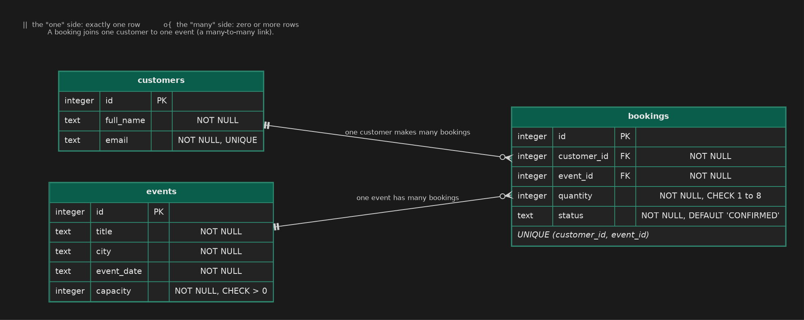

# Summative Assessment — TicketWave

## Learning Outcomes

| Learning Outcome | Section |
|---|---|
| Project Management / Agile Methodology | Section 1 |
| Brownfields Development | Section 2 |
| Testing | Section 3 |
| Systems Design | Section 4 |
| OOP | Section 5 |
| Build Pipelines / Scripting | Section 6 |
| Relational Databases | Section 7 |
| Web Development | Section 8 |

---

## Duration

**Total time: 3 hours 45 minutes**

| Section | Recommended Time |
|---|---|
| Section 1 — Agile Project Management | 20 minutes |
| Section 2 — Brownfields Development | 40 minutes |
| Section 3 — Testing | 30 minutes |
| Section 4 — Systems Design | 15 minutes |
| Section 5 — OOP | 15 minutes |
| Section 6 — Build Pipelines and Scripting | 30 minutes |
| Section 7 — Relational Databases | 35 minutes |
| Section 8 — Web Development | 40 minutes |

---

## Scoring

| Section | Marks |
|---|---|
| Section 1 — Agile Project Management | 12 |
| Section 2 — Brownfields Development | 16 |
| Section 3 — Testing | 12 |
| Section 4 — Systems Design | 10 |
| Section 5 — OOP | 8 |
| Section 6 — Build Pipelines and Scripting | 14 |
| Section 7 — Relational Databases | 14 |
| Section 8 — Web Development | 14 |
| **Total** | **100** |

---

## Before you start

You have joined the team behind **TicketWave**, an event-ticketing service. It prices tickets, takes bookings, calculates refunds, stores customers, events and bookings in a database, and has a web page where people browse events and book. The code was written by a developer who has since left the company.

**The project does not build yet.** Until it does, `mvn test` cannot run and Section 2 cannot be finished. Two tasks unblock the build, and you should do them first:

1. **Q6.2** — fix `pom.xml`
2. **Q5.1** — fix the two ticket classes

The rest of the sections can be done in any order.

Write your written answers in `answers.txt`, under the matching question heading. **Do not change the format of the file or create a new one.**

Each section states which files you may edit. You may **never** modify an existing test, unless the question explicitly tells you to add tests.

---

# Section 1 — Agile Project Management

## Scenario

When a TicketWave event sells out, customers simply see "Sold out" and leave. The business wants a **Waitlist** feature: a customer can join the waitlist for a sold-out event, and is emailed if tickets are released (for example when someone cancels and is refunded).

The team of seven (product owner, scrum master, business analyst, tester and three developers) has just been told to adopt Scrum. Sprints will be two weeks long. Nobody on the team has done it before.

| Task | Marks | What earns marks |
|---|---|---|
| Q1.1 — Agile and Scrum events | 4 | Agile described in your own words (1), four Scrum events named with the purpose of each (2), how retrospectives would help *this* team (1) |
| Q1.2 — Prioritising and planning a sprint | 4 | Backlog ranked with reasoning that mentions value, dependencies or risk (2), sprint scope within capacity and consistent with your ranking (1), a clear sprint goal (1) |
| Q1.3 — Tickets and user stories | 4 | Correct user story and testable acceptance criteria for Ticket 1 (2), epic split into two independently valuable stories with a reason (2) |

---

### Q1.1 — Agile and Scrum Events *(4 marks)*

(a) In your own words, what is Agile software development?
(b) Name the four Scrum events (ceremonies) that happen in every sprint and state the purpose of each in one sentence.
(c) The team has a history of missing release dates and only learning why afterwards. Explain how one of these events would help them.

---

### Q1.2 — Prioritising and Planning a Sprint *(4 marks)*

The product backlog currently contains the items below. The team's **capacity is 20 story points** per sprint.

| ID | Backlog item | Points | Notes from the product owner |
|---|---|---|---|
| A | Join the waitlist for a sold-out event | 8 | Sold-out events are losing sales today |
| B | Email waitlisted customers when a ticket is released | 8 | Cannot work without item A |
| C | Fix the typo in the checkout footer | 1 | Embarrassing but harmless |
| D | Upgrade the database server | 13 | Vendor support ends in six months |
| E | Export the attendee list as CSV | 5 | Two event organisers have asked for it |
| F | Add a dark mode | 3 | Nice to have |

(a) Rank all six items from highest to lowest priority and justify your ordering.
(b) Choose the items for the coming sprint. The total must not exceed capacity.
(c) Write a **sprint goal**: one sentence describing what the team wants to achieve, in terms of the customer or business rather than a list of tickets.

---

### Q1.3 — Tickets and User Stories *(4 marks)*

**Ticket 1: Join the waitlist for a sold-out event.** Write a user story and **at least two acceptance criteria** in Given / When / Then form.

**Ticket 2: Notify waitlisted customers when tickets are released.** The team estimates this at 21 points, which is too large for one sprint. Split it into **two smaller user stories** that can each be delivered and demonstrated on their own, and briefly explain why your split works.

---

# Section 2 — Brownfields Development

| Task | Marks | What earns marks |
|---|---|---|
| Q2.1 — Brownfield vs Greenfield | 4 | Accurate contrast (1), technical debt defined with an example from TicketWave (1), two or more sensible steps before changing inherited code, with reasons (2) |
| Q2.2 — Refactoring for maintainability | 12 | Split across two methods, 6 each: correct identification and explanation of the maintainability problem (2), the refactor actually resolves it (2), existing tests pass unmodified — binary (1), justification is specific to your change (1) |

---

### Q2.1 — Brownfield vs Greenfield *(4 marks)*

(a) Define and contrast brownfield and greenfield development.
(b) What is **technical debt**? Point to an example of it in TicketWave's code.
(c) Describe what you would do **before changing any code** in an inherited project like this, and why.

---

### Q2.2 — Refactoring for Maintainability *(12 marks)*

Somewhere in the codebase are **two methods**, each with a *different* maintainability problem in how its logic is written. Both behave correctly today, and the existing tests prove it.

For each method, complete all three steps.

#### Q2.2.1 — Locate and describe the problem

Name the class and method. Say what is wrong with how it is written (name the code smell if you can) and why that matters for reading, testing or safely changing it. *(Write this in `answers.txt`.)*

#### Q2.2.2 — Refactor

Refactor the method to resolve the problem you identified. Its public signature and its behaviour must not change. You may add private helper methods and constants.

#### Q2.2.3 — Prove behaviour preservation

Run the existing test suite before and after your refactor:

```bash
mvn test
```

Your refactored code must pass every existing test **unchanged**. In `answers.txt`, write **3 to 5 sentences per method** justifying why your new version is more maintainable than the original.

---

# Section 3 — Testing

| Task | Marks | What earns marks |
|---|---|---|
| Q3.1 — Kinds of tests | 3 | One mark per test correctly classified *and* justified |
| Q3.2 — Writing tests | 6 | Boundary tests at both ends of the quantity rule (2), valid, invalid and `null` cases for the other three methods (1), clear names with one behaviour per test and meaningful assertions (1), defect identified and explained in `answers.txt` (1), defect fixed and all your tests pass (1) |
| Q3.3 — Reading test reports | 3 | One mark for each of the three parts |

---

### Q3.1 — Kinds of Tests *(3 marks)*

Classify each of the following as a **unit**, **integration** or **acceptance** test, and justify your answer in one or two sentences.

1. `RefundServiceTest.fullRefundExactlySevenDaysBefore`
2. A test that starts the API against a real in-memory database, sends `POST /api/bookings`, and then checks that a row was stored in the `bookings` table.
3. *"On the staging site, the product owner books two tickets for an event, receives a confirmation email with a booking reference, and confirms this is what the business asked for."*

---

### Q3.2 — Writing Tests *(6 marks)*

`BookingValidator` decides which bookings TicketWave will accept, but its test class contains only one worked example. The rules are in the Javadoc at the top of `BookingValidator.java`.

Open `BookingValidatorTest.java` and add **at least six more tests**. Together they must cover:

- the quantity rule, at **both boundaries** (each side of each limit)
- `isValidSeat`, `isValidPromoCode` and `isValidEmail`: valid values, invalid values and `null`
- at least one assertion on an **exception message**

Then run `mvn test`.

`BookingValidator` contains **one defect**. Good tests will find it. If one of your tests fails because the production code is wrong (not because your test is wrong), then:

1. in `answers.txt`, name the test that exposed it and explain the defect;
2. fix the defect in `BookingValidator.java`;
3. re-run `mvn test` and confirm everything passes.

> You may not edit the worked example that is already in the file.

---

### Q3.3 — Reading Test Reports *(3 marks)*

A teammate posts this from the pipeline and says *"all green, ship it"*:

```
[INFO] Tests run: 120, Failures: 0, Errors: 0, Skipped: 0
[WARNING] Flakes: 1
[WARNING]   BookingApiTest.concurrentBookings: passed on rerun 3 of 3
[INFO] BUILD SUCCESS
[INFO] Total time: 11:42 min

Line coverage: 88%
Two weeks ago: 120 tests, total time 3:05 min, no flakes.
```

(a) What does the flake warning tell you, and why is `BUILD SUCCESS` not enough on its own to justify shipping?
(b) What does 88% line coverage tell you, and what does it *not* tell you?
(c) What do you notice about the change in total time, and why is it more useful to watch these numbers over many pipeline runs than to read only the latest one?

---

# Section 4 — Systems Design

| Task | Marks | What earns marks |
|---|---|---|
| Q4.1 — System design | 4 | Accurate definition (1), what it aims to achieve (1), cohesion and coupling both explained (1), applied to a TicketWave example (1) |
| Q4.2 — UML sequence diagram | 6 | Participants and lifelines (2), messages in the correct order with return messages (2), the sold-out alternative shown correctly (2) |

---

### Q4.1 — System Design *(4 marks)*

Define what system design (software design) is and what it aims to achieve. Then explain **cohesion** and **coupling**, and describe how TicketWave's `BookingService` could be designed badly and then well with respect to both. (For example: what if it built SQL strings and formatted JSON itself?)

---

### Q4.2 — UML Sequence Diagram *(6 marks)*

Draw a **UML sequence diagram** for the scenario *"a customer books tickets for an event"*. It must include these four participants: `Browser`, `API`, `BookingService` and `Database`.

Show, in order:

- the browser sending `POST /api/bookings` to the API, and the API calling the service;
- the service asking the database how many confirmed tickets the event has sold;
- **an alternative (`alt`) fragment** with two branches: enough tickets remain (the booking is saved and the browser receives `201 Created` with a reference), and the event is sold out (the browser receives `409 Conflict`);
- return messages drawn as dashed arrows.

Write your diagram as **PlantUML text** in `answers.txt` (or as plain-text art if you prefer). A small example of the syntax, for a different scenario:

```
@startuml
actor Customer
participant Kiosk
participant Printer
Customer -> Kiosk : pressPrint()
Kiosk -> Printer : print(document)
alt paper available
    Printer --> Kiosk : done
    Kiosk --> Customer : "Printed"
else out of paper
    Printer --> Kiosk : error
    Kiosk --> Customer : "Please refill paper"
end
@enduml
```

---

# Section 5 — OOP

| Task | Marks | What earns marks |
|---|---|---|
| Q5.1 — Fix the OOP structure | 4 | Correctly identifies each issue (2), correctly resolves each issue *without weakening encapsulation* (2) |
| Q5.2 — Encapsulation, abstraction and polymorphism | 4 | One mark for each of (a), (b), (c) and (d) |

---

### Q5.1 — Fix the OOP Structure *(4 marks)*

`StandardTicket` and `VipTicket` do not compile. Each has a **different** structural problem. Read the compiler output, work out what is wrong in each class and fix it.

> Only `StandardTicket.java` and `VipTicket.java` may be edited. You may not modify `Ticket.java` or any test.
> This should take no more than 5 minutes once the build gets that far.

---

### Q5.2 — Encapsulation, Abstraction and Polymorphism *(4 marks)*

Answer in `answers.txt`:

(a) `Ticket` keeps `seat` and `basePrice` `private` and exposes getters. What is this principle called, and what would go wrong if the fields were `public`?
(b) In `Main`, two variables of type `Ticket` are printed and each shows a different price and perks. Which OOP principle produces that behaviour, and how? (Hint: look at `Ticket.toString`.)
(c) `Ticket` is an abstract class. When would you choose an interface instead of an abstract class?
(d) The business wants a `StudentTicket`. What would you add, and what (if anything) must change in the existing classes? Why is that a good property for a design to have?

---

# Section 6 — Build Pipelines and Scripting

| Task | Marks | What earns marks |
|---|---|---|
| Q6.1 — Versioning a release | 3 | Correct version and sound reason for each of **(a)**, **(b)** and **(c)** (1 each) |
| Q6.2 — Fix the build | 3 | Correct Maven Central coordinates for the first dependency (1) and the second (1), each declared with the correct scope (1) |
| Q6.3 — Build a pipeline | 4 | Stages defined in the correct order (1), `test` job publishes a JUnit report even when tests fail (1), dependency cache configured per branch (1), `package` job needs `test`, keeps its jar for two days and runs only for version tags (1) |
| Q6.4 — Version bump script | 4 | Argument handling (1), `VERSION` file problems handled (1), correct arithmetic including resets and numeric comparison (1), file rewritten, message printed, works from any directory, fails fast (1) |

---

### Q6.1 — Versioning a Release *(3 marks)*

TicketWave is currently released at version `4.7.2`. Each change below is made **independently**, starting from `4.7.2` every time. State the new version number and explain why.

- **(a)** You fix a rounding bug in `RefundService`. No public method changes.
- **(b)** You add a new public method to `PricingService`. Nothing existing changes.
- **(c)** You change the return type of the public method `ticketPrice` from `double` to `BigDecimal`.

---

### Q6.2 — Fix the Build *(3 marks)*

`pom.xml` is missing **two** dependencies. Running `mvn compile` or `mvn test` tells you what cannot be found, for example `package org.apache.commons.lang3 does not exist`. Work out which library each error points to, find its coordinates on [Maven Central](https://mvnrepository.com/repos/central) and add it.

- One library is needed by the application's own code at runtime.
- The other is needed only when running the tests. The `junit.version` property is already defined in `pom.xml`; use it.

Declare each with the **correct scope**.

---

### Q6.3 — Build a Pipeline *(4 marks)*

The project builds on GitLab CI. The pipeline is defined in `.gitlab-ci.yml` and calls the same `Makefile` targets you use locally. The image, the Maven cache location (`MAVEN_OPTS`) and the `build` job are provided as a worked example.

Complete the pipeline so that:

1. `stages` are defined for **build**, **test** and **package**, in that order;
2. a `test` job in the `test` stage runs `make test`, and its JUnit XML results (Surefire writes them to `target/surefire-reports/`) are published as a **test report**, **even when the tests fail**;
3. Maven's local repository (`.m2/repository/`) is **cached**, with a separate cache for each branch (use the predefined variable `CI_COMMIT_REF_SLUG`);
4. a `package` job in the `package` stage runs `make package`, **needs** the `test` job, keeps the built jar (`target/*-jar-with-dependencies.jar`) as an artifact that expires after **2 days**, and runs **only for version tags** of the form `v1.2.3` (the predefined variable is `CI_COMMIT_TAG`).

> You are allowed to use the [CI/CD YAML reference](https://docs.gitlab.com/ci/yaml/).

---

### Q6.4 — Version Bump Script *(4 marks)*

The project's current version is stored in a one-line file named `VERSION` in the project root. Write `scripts/bump-version.sh`. Usage: `./scripts/bump-version.sh <major|minor|patch>`

| Situation | Required behaviour |
|---|---|
| Not exactly one argument | Print `Usage: bump-version.sh <major\|minor\|patch>` to **stderr** and exit with status **2**. Change nothing. |
| The argument is not `major`, `minor` or `patch` | Print `Invalid bump type: <the value>` (you may add more text after it) to **stderr** and exit with status **1**. Change nothing. |
| `VERSION` file does not exist | Print `VERSION file not found` (you may add more text after it) to **stderr** and exit with status **1**. |
| `VERSION` does not contain `MAJOR.MINOR.PATCH` (digits only) | Print `Malformed VERSION` (you may add more text after it) to **stderr**, exit with status **1**, and leave the file untouched. |
| Valid | Work out the new version, overwrite `VERSION` with it (one line), and print `Bumped <old> -> <new>`. A `major` bump resets minor and patch to 0; a `minor` bump resets patch to 0. |

The script must find `VERSION` **relative to the script's own location** (the project root is one directory above `scripts/`), so that it works no matter which directory it is run from. Numbers must be treated as numbers: `1.9.9` with `minor` becomes `1.10.0`.

Start the script with a `#!/usr/bin/env bash` line and make it fail fast on errors and on unset variables.

Check your work with the provided self-check, which copies your script into a temporary project so your real `VERSION` file is never touched:

```bash
./scripts/check-bump.sh
```

---

# Section 7 — Relational Databases

## Scenario

TicketWave currently keeps everything in memory. The next step is to persist **customers**, **events** and **bookings** in a SQLite database. A booking is the link between one customer and one event. `resources/erd.png` is the entity relationship diagram:



`Database.connect(path)` is provided. `DatabaseSchema.createSchema(Connection)` and the SQL in `EventQueries` are empty. (SQLite does not enforce foreign keys unless asked to; `Database.connect` already turns enforcement on for you.)

> `resources/SQL-Cheat-Sheet.pdf` is provided as a reference for SQL syntax.

| Task | Marks | What earns marks |
|---|---|---|
| Q7.1 — Keys and structure | 3 | Primary and foreign keys defined (1), why `bookings` is a separate table (1), what the composite `UNIQUE` constraint protects (1) |
| Q7.2 — Create the schema | 6 | `customers` table correct (1), `events` table correct including `CHECK` (2), `bookings` table correct including both foreign keys, `UNIQUE`, `DEFAULT` and `CHECK` (3) |
| Q7.3 — Write the queries | 5 | Query (a) (1), query (b) (2), query (c) (2) |

---

### Q7.1 — Keys and Structure *(3 marks)*

In `answers.txt`:

(a) Define a **primary key** and a **foreign key**.
(b) A customer can book many events, and an event is booked by many customers. Explain why this needs a separate `bookings` table, rather than a `customer_id` column in `events` or an `event_id` column in `customers`.
(c) The `bookings` table declares `UNIQUE (customer_id, event_id)`. What rule of the business does this enforce, and why is it not enough to make each of the two columns `UNIQUE` on its own?

---

### Q7.2 — Create the Schema *(6 marks)*

Implement `DatabaseSchema.createSchema(Connection connection)` so that it creates all three tables **exactly as shown in the ERD**, using one `CREATE TABLE` statement per table, in an order in which every foreign key points at a table that already exists. Every constraint in the ERD must be declared: primary keys, foreign keys, `NOT NULL`, `UNIQUE` (including the composite one), `DEFAULT` and `CHECK`.

> Schema creation only. Do not insert or query any data here.
> Run `mvn test` to check your schema against `DatabaseSchemaTest`.

---

### Q7.3 — Write the Queries *(5 marks)*

Complete the three SQL constants in `EventQueries.java`. Each is described in the Javadoc above it, and the column names your query returns matter. `EventQueriesTest` seeds a small database and checks each one. (It needs a correct Q7.2 to pass.) Remember: only bookings with status `'CONFIRMED'` count as sold tickets.

- **(a)** All of one customer's bookings, with event titles *(1 mark)*
- **(b)** Tickets sold per event, including events with no bookings *(2 marks)*
- **(c)** The sold-out events *(2 marks)*

---

# Section 8 — Web Development

## Scenario

The TicketWave front end lives in `web/`: `index.html`, `styles.css` and `app.js`. Visitors browse a list of upcoming events, search it, and book tickets with a form. The page is wired up for you: it loads events from the API, calls your `filterEvents` and `renderEventCards` as the visitor types, and calls your `submitBooking` when the form is submitted. Your job is to make the four pieces work.

The page talks to this API (already built by another team):

```
GET  /api/events
  200 OK -> [ { "id": 1, "title": "Jazz Night", "city": "Cape Town",
                "priceCents": 25000, "remaining": 40 }, ... ]

POST /api/bookings      body: { "eventId": 1, "email": "lerato@example.com", "quantity": 2 }
  201 Created -> { "reference": "BK-000042", ... }
  400 Bad Request  -> the body was invalid
  409 Conflict     -> the event is sold out
```

Check your work with:

```bash
make web-test        # runs: node --test web/test/app.test.js  (Node 20+)
```

To try the page by eye, open `web/index.html` in a browser (the API itself is not running, so expect the "Could not load events." message).

| Task | Marks | What earns marks |
|---|---|---|
| Q8.1 — Semantic, accessible HTML | 3 | Language, landmarks and image alt text (1), labelled search field and a validated booking fieldset with submit button (1), events section and status message wired for assistive technology (1) |
| Q8.2 — Responsive CSS | 2 | Auto-filling grid and a visible focus indicator (1), custom property for the sold-out colour and reduced-motion support (1) |
| Q8.3 — JavaScript | 6 | `formatPrice` (1), `filterEvents` (1), `renderEventCards` (2), `submitBooking` (2) |
| Q8.4 — HTTP and validation | 3 | Correct status code for each of four situations (2), why the server must validate too (1) |

---

### Q8.1 — Semantic, Accessible HTML *(3 marks)*

Edit `index.html` (only) so that:

1. the `<html>` element declares the page language as English; the generic `<div class="top">` and `<div class="main">` wrappers become `<header>` and `<main>`; the `<div class="menu">` becomes a `<nav>` labelled `aria-label="Main"`; and the logo image has meaningful `alt` text;
2. the search box is a `type="search"` input with `id="search"` and a `<label>` linked to it; the booking form contains a `<fieldset>` with a `<legend>` that groups two labelled inputs: an **email** input (`id="email"`, `name="email"`, `type="email"`, required) and a **quantity** input (`id="quantity"`, `name="quantity"`, `type="number"`, required, minimum 1, maximum 8); and the form has a submit button;
3. `<div id="events">` becomes a `<section id="events">` named by the existing heading through `aria-labelledby`, and `#message` gets `role="status"` so that screen readers announce booking results.

---

### Q8.2 — Responsive CSS *(2 marks)*

Edit `styles.css`:

1. lay the `.cards` container out as a **CSS grid** whose columns are `repeat(auto-fill, minmax(16rem, 1fr))`, with a `gap`. Give a `.card` a visible **outline or box-shadow** when something inside it has focus (`:focus-within`);
2. add a `--sold-out` **custom property** to `:root` and use it, via `var()`, as the background of `.badge-sold-out`. Then switch card transitions off for people who prefer **reduced motion**, using a `prefers-reduced-motion` media query.

---

### Q8.3 — JavaScript *(6 marks)*

Implement the four functions in `app.js`. Do not change `escapeHtml` or the page wiring at the bottom.

| Function | Required behaviour |
|---|---|
| `formatPrice(cents)` | `12345` → `'R123.45'`. Whole rands, a dot, then exactly two digits of cents (`5` → `'R0.05'`, `9900` → `'R99.00'`). No thousands separator. |
| `filterEvents(events, query)` | Return a **new** array of the events whose `title` or `city` contains `query`, ignoring case. Trim the query first; an empty (or blank) query returns a copy of all events. Never modify the array that was passed in. |
| `renderEventCards(events)` | Return a string of HTML. If `events` is empty or missing: `<p class="empty">No events match your search.</p>`. Otherwise `<div class="cards">` containing one `<article class="card" data-id="{id}">` per event, in the order given, holding `<h3>{title}</h3>`, `<p class="city">{city}</p>`, `<p class="price">{price via formatPrice}</p>` and, **only when `remaining` is `0`**, `<span class="badge-sold-out">Sold out</span>`. All text that comes from the event must be escaped (use the provided `escapeHtml`). |
| `submitBooking(payload, fetchFn)` | Call `fetchFn('/api/bookings', options)` with `method: 'POST'`, a `Content-Type: application/json` header and the payload as a JSON string body. Return `{ ok: true, booking }` (the parsed response body) on **201**. On **409** return `{ ok: false, error: 'Sorry, this event is sold out.' }`. On **400** return `{ ok: false, error: 'Please check your details and try again.' }`. On any other status return `{ ok: false, error: 'Something went wrong. Please try again.' }`. If the request itself throws (for example the network is down), return `{ ok: false, error: 'Network error. Check your connection and try again.' }`. The function must never throw. |

---

### Q8.4 — HTTP and Validation *(3 marks)*

In `answers.txt`:

(a) *(2 marks, half a mark each)* Give the most appropriate HTTP status code for each situation, with a few words of justification:

1. A request arrives with no login token, or an expired one.
2. A logged-in customer asks to view another customer's bookings and is not allowed to.
3. A customer tries to book an event that has just sold out.
4. A customer submits a booking whose body is missing the email address.

(b) *(1 mark)* The booking form already uses `required`, `type="email"`, `min` and `max`. Why must the server still validate every booking?

---

### End of Assessment

---

## Project structure

```
ticketwave-assessment/
  README.md
  answers.txt
  pom.xml
  Makefile
  .gitlab-ci.yml
  VERSION
  scripts/
    bump-version.sh         (Q6.4 - you write this)
    check-bump.sh           (self-check - do not edit)
  resources/
    erd.png
    SQL-Cheat-Sheet.pdf
  src/
    main/java/za/co/ticketwave/
      TicketType.java  Event.java  Booking.java
      PricingService.java  RefundService.java
      Ticket.java  StandardTicket.java  VipTicket.java
      BookingValidator.java  BookingReference.java  Main.java
      Database.java  DatabaseSchema.java  EventQueries.java
    test/java/za/co/ticketwave/
      PricingServiceTest.java  RefundServiceTest.java
      StandardTicketTest.java  VipTicketTest.java
      BookingValidatorTest.java  BookingReferenceTest.java
      DatabaseSchemaTest.java  EventQueriesTest.java
  web/
    index.html  styles.css  app.js
    test/app.test.js
```

## Useful commands

```bash
# Compile the source code
mvn compile

# Run the Java test suite
mvn test

# Package the application into a jar (skipping tests)
mvn package -DskipTests

# Run the packaged jar
java -jar target/ticketwave-jar-with-dependencies.jar

# Run the web tests
node --test web/test/app.test.js

# Check your version bump script
./scripts/check-bump.sh
```

The `Makefile` wraps these commands and is what the GitLab CI pipeline runs:

```bash
make compile
make test
make package
make web-test
```
